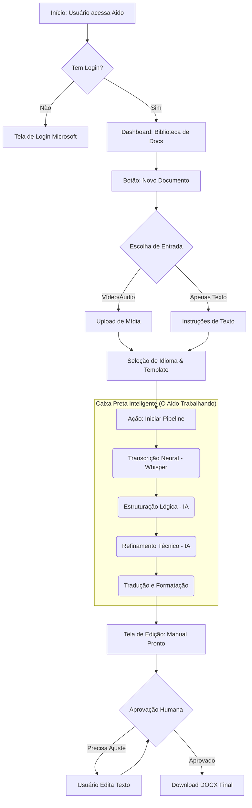
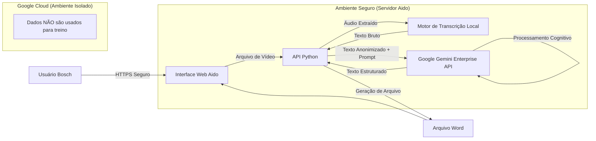

# Athena Doc 4: Arquitetura Executiva e Fluxos de Valor

## 1. O que é o Aido? (Visão para Liderança)

O **Aido (Automação Inteligente de Documentos)** é uma plataforma que elimina o gargalo da documentação técnica. Em vez de engenheiros gastarem horas escrevendo manuais após uma intervenção técnica, eles gravam um vídeo rápido. O Aido usa IA para "assistir", entender, escrever, formatar e traduzir esse manual automaticamente.

**Valor Agregado:**
*   **Tempo:** Redução de 4h para 5 minutos na criação de um manual.
*   **Padronização:** Todos os manuais seguem estritamente o padrão Bosch (Fontes, Estrutura, Tons).
*   **Globalização:** Tradução técnica instantânea e precisa para Alemão/Inglês.

---

## 2. Diagrama de Fluxo do Usuário (Jornada)

Visualização simplificada de como o usuário interage com o sistema.

---

## 3. Arquitetura de Dados e Segurança (Compliance)

Este diagrama foca em **onde os dados vivem**, crucial para auditoria de risco.

---

## 4. Matriz de Riscos e Mitigação

Esta tabela é essencial para a aprovação de Security & Compliance.

| Risco | Impacto | Probabilidade | Estratégia de Mitigação (Técnica) |
| :--- | :--- | :--- | :--- |
| **Vazamento de Áudio** | Alto | Baixíssima | O áudio é processado **100% Localmente (Offline)**. O arquivo de som nunca sai do servidor da empresa. |
| **Vazamento de Texto** | Médio | Baixa | Apenas o texto (metadados) vai para a nuvem Google via API Enterprise criptografada, que possui contrato de não-uso de dados para treino. |
| **Alucinação (Erro IA)** | Médio | Média | A IA é configurada com `temperature=0` (criatividade desligada). O pipeline inclui revisão humana obrigatória antes da publicação final. |
| **Indisponibilidade** | Baixo | Baixa | O sistema roda em containers independentes. Se a internet cair, a transcrição local ainda funciona (o passo de IA aguarda reconexão). |
| **Violação de Estilo** | Baixo | Média | O sistema usa "System Prompts" rígidos que forçam a IA a agir como um "Engenheiro Bosch", garantindo a terminologia correta. |

---

## 5. Conclusão para Liderança

O Aido não é uma "ferramenta experimental". É uma **linha de montagem de software para documentos**.

Ele foi desenhado com três pilares:
1.  **Segurança Primeiro:** O áudio, que é a parte mais sensível, nunca toca a nuvem.
2.  **Humano no Comando:** A IA faz o trabalho braçal, mas o engenheiro (usuário) sempre tem a palavra final na edição.
3.  **Escalabilidade:** A arquitetura modular permite trocar o "cérebro" (IA) ou a "audição" (Whisper) no futuro sem refazer o sistema inteiro.

Estamos prontos para escalar do piloto para a produção.
